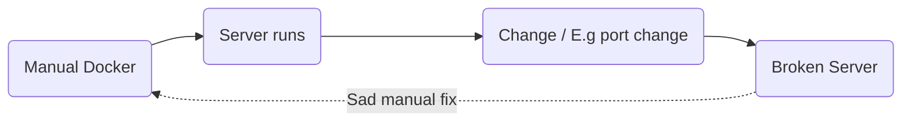
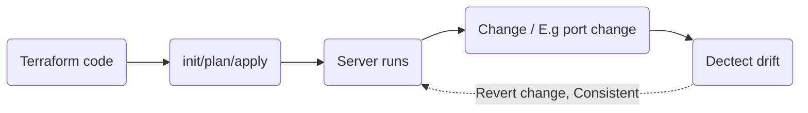

# From Imperative to Declarative: From a CLI Docker server to a Terraform infrastructure

## Intended Learning Outcomes (ILO)

1. Understand differences between imperative Docker, Compose, and IaC with Terraform.
2. See how each approach handles changes and drift.
3. Run the same app via three tools and compare workflows.

Managing infrastructure with a tool like Docker ensurs that once something is defined it should run everywhere, to enhance this and make the infra easily distributable you can define the server instance with docker compose.

The idea is that with Declarative infra such as Terraform, you can define, reproducable and more reliable infrastructure. Terraform manages infrastrucutre drift detection, and alerts as well as allows the user to revert changes to previous stable version. Using terraform would ensure that your cloud server stays stable while still allowing developers to regularly interface with it.

The ideas presented in this

But definig the infra with Terraform $^{TM}$, the system could look more lite this:

This would define an automatic feedback loop which ensures the server is always running and any breaking changes to the infrastrucutre would be reverted.
